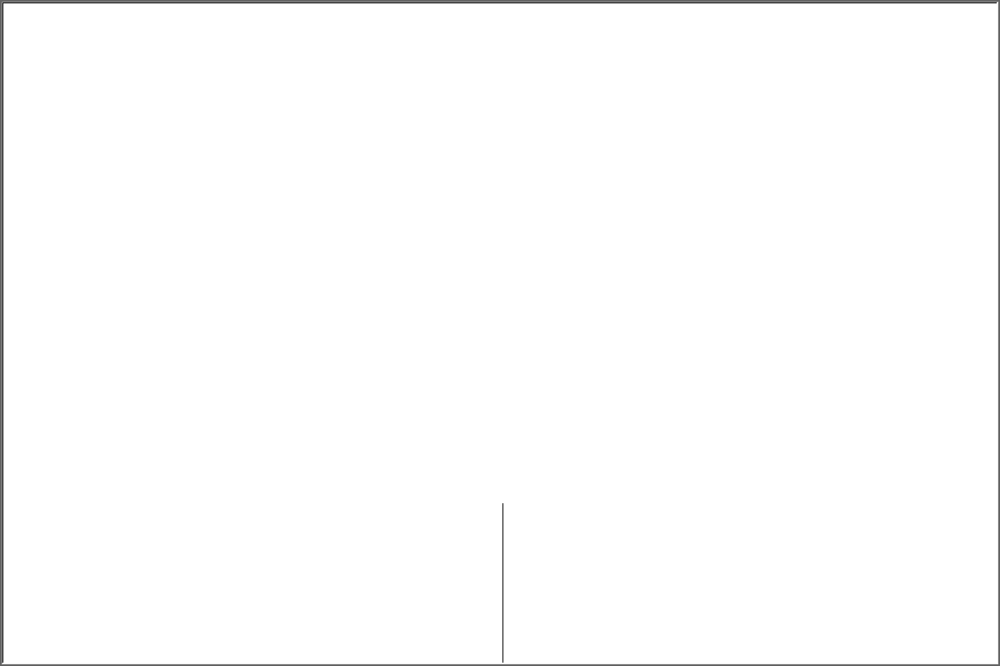
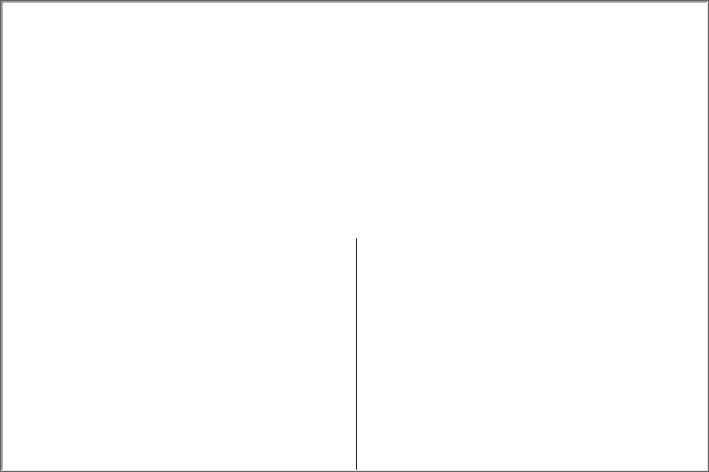

# L-System

An L-system or Lindenmayer system is a parallel rewriting system and a type of formal grammar. An L-system consists of an alphabet of symbols that can be used to make strings, a collection of production rules that expand each symbol into some larger string of symbols, an initial "axiom" string from which to begin construction, and a mechanism for translating the generated strings into geometric structures. L-systems were introduced and developed in 1968 by Aristid Lindenmayer, a Hungarian theoretical biologist and botanist at the University of Utrecht. Lindenmayer used L-systems to describe the behaviour of plant cells and to model the growth processes of plant development. L-systems have also been used to model the morphology of a variety of organisms and can be used to generate self-similar fractals.<sup>[1](https://en.wikipedia.org/wiki/L-system)</sup>

# Installation

You can download and install the latest release as follows:

1. Open a terminal
2. Run `git clone https://github.com/A-Bak/l-system`
3. Switch to the directory `cd l-system`
4. Run `python setup.py install`
5. Done

## Usage

After installing the latest version you can run the script as follows:

```bash
lsystem-gui lsystem=LSYSTEM_NAME
```
Where `LSYSTEM_NAME` is the name of the L-System configuration file. There are several configuration files provided, but you can create your own custom L-System configuration as well.

|  |Implemented L-Systems|
|--|---------|
|1.|[dragon_curve](https://en.wikipedia.org/wiki/Dragon_curve)|
|2.|[hexagonal_gosper_curve](https://en.wikipedia.org/wiki/Gosper_curve)|
|3.|[koch_snowflake](https://en.wikipedia.org/wiki/Koch_snowflake)|
|4.|[koch_quadratic_island](https://en.wikipedia.org/wiki/Minkowski_sausage)|
|5.|[plant_edge_rewriting_1]()|
|6.|[plant_edge_rewriting_2]()|
|7.|[plant_node_rewriting_1]()|
|8.|[plant_node_rewriting_2]()|
|9.|[sierpinsky_triangle](https://en.wikipedia.org/wiki/Sierpi%C5%84ski_triangle)|
|10.|[squared_squares]()|
|11.|[stochastic_plant_edge_rewriting]()|

NOTE: if you want to create your own L-System configuration files add them to the
`conf/lsystem` directory.


### Plant Edge Rewriting 1


### Plant Edge Rewriting 2


### Plant Node Rewriting 1


### Plant Node Rewriting 2


### Stochastic Plant Edge Rewriting


## Configuration File Structure

The main `config.yaml` file extends application and lsystem configuration files.
This file contains the default configuration of the application when it is called
without command line arguments.

```yaml
defaults:
  - app: APP_CONFIG
  - lsystem: LSYSYSTEM_CONFIG
```
### L-System Configuration

The lsystem `*.yaml` files contains the following:

1. Name of the L-System
```yaml
_target_: lsystem.config.LSystemConfig
name: LSYSTEM_NAME
```

2. Context-free grammar $G = (N, T, P, S)$ of the L-System:
    - $N$ - a list of non-terminal symbols $n \in N$ (appear on the left side of the rules)
    - $T$ - a list of terminal symbol $t \in T$ (only appear on the right side of the rules)
    - $P$ - a list of production rules in the form of $N \rightarrow (N \cup T)^*$
    - $S$ - starting axiom, $S = (N \cup T)^*$

```yaml
grammar:
  _target_: lsystem.model.grammar.Grammar.from_dict
  nonterminals: LIST_OF_NONTERMINAL_SYMBOLS
  terminals: LIST_OF_TERMINAL_SYMBOLS
  rules: LIST_OF_RULES
  axiom: STARTING_AXIOM
```

3. Renderer configuration for the L-System:

    - `line_segment_length` - starting length of the line segments
    - `line_segment_length_reduction` - percentage length reduction with each successive generation (step)
    - `angle_offset` - angle by which the renderer turns to the left/right

    - `instruction_mapping` - dictionary mapping symbols $s \in N \cup T$ to their corresponding renderer instuctions from `InstructionEnum`:
        - `NOP` - no operation
        - `FORWARD` - draw line segment of given length in the direction the renderer is facing
        - `LEFT` - turn left by a number of degrees
        - `RIGHT` - turn right by a number of degrees
        - `SAVE` - push the `(X, Y, angle)` state of the renderer onto a stack 
        - `LOAD` - pop the `(X, Y, angle)` state of the renrerer from a stack
         
    - `starting_state` - starting state of the renderer:
        - `x` - starting X coordinate
        - `y` - starting Y coordinate
        - `angle` - starting angle

```yaml
renderer_config:
  line_segment_length: LENGHT_PIXELS
  line_segment_length_reduction: LENGTH_REDUCTION_PERCENTAGE
  angle_offset: ANGLE_IN_DEGREES
  
  instruction_mapping:
    _target_: lsystem.mapping.InstructionMapping.from_dict
    map: INSTRUCTION_DICT

  starting_state:
    _target_: lsystem.renderer.RendererState
    x: STARTING_X
    y: STARTING_Y
    angle: STARTING_ANGLE

```

### L-System Configuration File Example

Example of a lsystem configuration file `dragon_curve.yaml`:
```yaml

_target_: lsystem.config.LSystemConfig
name: "Dragon Curve L-System"

grammar:
  _target_: lsystem.model.grammar.Grammar.from_dict
  nonterminals: [F, G]
  terminals: [+, -]
  rules: [
    [F, F+G],
    [G, F-G]
  ]
  axiom: F

renderer_config:
  line_segment_length: 50
  line_segment_length_reduction: 0.80
  angle_offset: 90

  instruction_mapping:
    _target_: lsystem.mapping.InstructionMapping.from_dict
    map: {
      'F': FORWARD,
      'G': FORWARD,
      '+': RIGHT,
      '-': LEFT,
      '[': SAVE,
      ']': LOAD,
    }

  starting_state:
    _target_: lsystem.renderer.RendererState
    x: 0
    y: 0
    angle: 0

```

## App Configuration File

The app `*.yaml` configuration file contains parameters for setting up the GUI of the application.

```yaml
window_size: [WIDTH, HEIGHT]
line_color: [R, G, B]
background_color: [R, G, B]
```

---